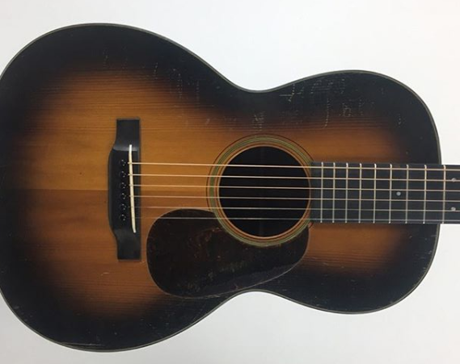

# vintagemartins
Static website for <a href="https://vintagemartins.com/" target="_blank">vintagemartins.com</a> (maintainer but not author).

This is a site that I was asked to maintain by my friend who runs the luthier business <a href="https://bruceandsons.com/" target="_blank">bruceandsons.com</a>.
He inherited an old PHP site that drove business to his store, and didn't want it to be shut down when the original author decided to abandon the project.

I ripped out all the PHP and converted it to a basic static HTML website so we could host it for free on surge.sh.
